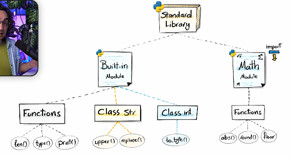
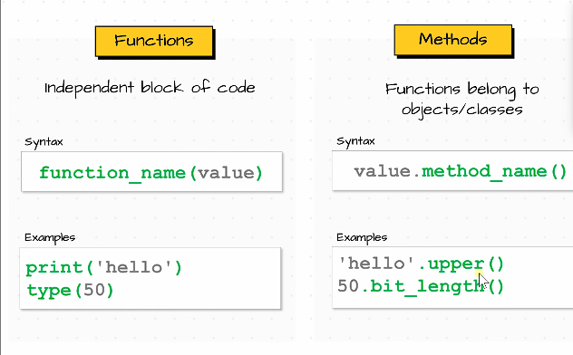
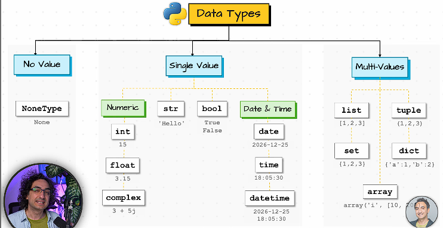

# CHAPTER:6 Python Input Function
```
# A Built-in Python function that stops your program to get user input
# Ask the user to input their name
input("Enter your name: ")
input("Enter your password: ")

# INPUT and VARIABLES
# Using INPUT() alone reads the user's response but immediately discards it
# the keep the value, assign it to the variable 
name = input("Enter your name: ")
location = input("Enter your location: ")
password = input("Enter your pass word: ")

print("your name",name)
print("your location",location)
print("your password",password)


# Hard coded values vs Dynamic values from input
place = input("Enter your place")  # Dynamic Values: Data entered by the users that can vary each time the programs runs
country = "India" # this value is already predefined before the execution of the programme
print("your place",place)

# Hard-coded(static) value
# Fixed piece of data written directly into your code that never changes at runtime

# note: Input lets your program ask questions and react to what the users types,making it feel alive.


# Two builtin functions which we learned in this chapter is
# INPUT()
# PRINT()


```
# CHAPTER : Python Data Types

```
# Everything in python is an "object", including integers/floats
# Most important and types (classes)

# Categories of data types 
# NO VALUE -> none
# Single Value -> int, float, String, boolean [They always holds one value and also called primitive Types]
# Multi Values -> list, dictionaries, set, tuples [Data structures, collections and containers]


# Python automatically detects data types. 
# Dynamic: data types can change any time in Python. Due to its dynamic nature 
# Why do we need data types? 
# To know how to operate data and also to prevent problems, we need data types. 

# integers |int | whole no as 3,300
# floating point |float| Numbers with a decimal point like 2.3, 4.6, 100.0. |
# strings |str| order sequence of character 
# List |order sequence of objects|
# dictionaries |Unordered key: Values pairs
# Tuples |tup|Order immutable sequence of objects (10,"hello",200.3)
# Sets |set| Unordered collection of unique objects ("A","b")
# Booleans |bool| Logical value indicating True or False

a = 10 #int
b = 3.13 # float
c = "Hello" #str
d = 'Hi' #str
e = True
f = False
g=None  # Means no value, nothing, or unknown.
# It is used to show the absence of any data. 

print(type(a))
print(type(b))
print(type(c))
print(type(d))
print(type(e))
print(type(f))
print(type(g))

```

# standard library


---
- difference between functions and methods



## Data type



